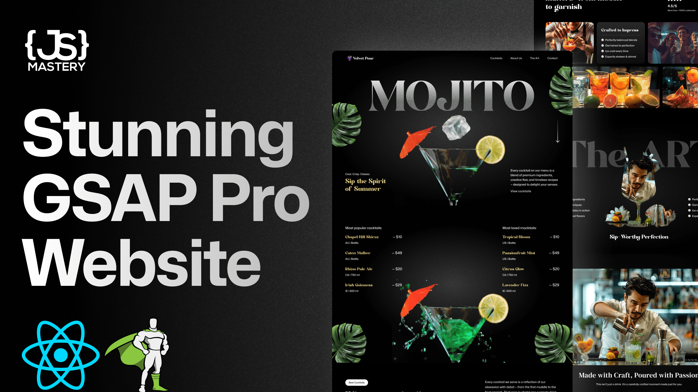
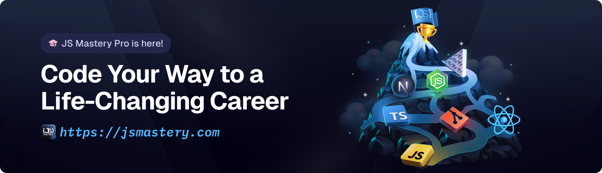

# 🍹 Cocktails Landing Page  
*A modern, animated, and fully responsive landing page built with GSAP, React & Vite.*  



---

## 🚀 Live Demo  
🔗 **[View Project](https://your-live-demo-link.com)** *(Add your deployed link here)*  

---

## 📌 Project Overview  
The **Cocktails Landing Page** is a visually stunning, fully responsive, and interactive web project designed to showcase an elegant cocktail-themed landing page.  
Built with **React**, **Vite**, **Tailwind CSS**, and **GSAP**, this project demonstrates smooth animations, engaging UI, and seamless performance.  

This project is perfect for:  
✅ Learning **GSAP animations**  
✅ Practicing **responsive UI design**  
✅ Improving **React + Vite project structure**  
✅ Showcasing your **frontend development skills**

---

## 🖼️ Preview  

### **Hero Section**


### **Video Section**


### **Smooth Animations**


---

## 🛠️ Tech Stack  

| Technology     | Description |
|---------------|-------------|
| **React.js**  | Frontend library for building components |
| **Vite**      | Fast and optimized React bundler |
| **Tailwind CSS** | Modern utility-first CSS framework |
| **GSAP**      | High-performance JavaScript animation library |
| **JavaScript (ES6+)** | Core scripting language |
| **HTML5 / CSS3** | Semantic structure & styling |

---

## ⚡ Features  

✅ **Stunning GSAP Animations** – Smooth, elegant transitions  
✅ **Fully Responsive** – Perfect on mobile, tablet, and desktop  
✅ **Interactive Sections** – Engaging design and scroll-based effects  
✅ **Optimized Performance** – Built with Vite for speed  
✅ **Reusable Components** – Clean and modular structure  

---

## 📂 Folder Structure  

```

gsap-landing-page/
│── public/
│   ├── images/         # All images & assets
│   ├── fonts/          # Custom fonts
│   ├── videos/         # Optimized background videos
│   └── readme/         # Screenshots for documentation
│
│── src/
│   ├── components/     # React components
│   ├── assets/         # SVG & icons
│   ├── App.jsx         # Main app file
│   ├── main.jsx        # Entry point
│   └── index.css       # Global styles
│
├── package.json        # Project dependencies
├── vite.config.js      # Vite configuration
├── README.md           # Project documentation
└── .gitignore

````

---

## ⚙️ Installation & Setup  

Follow these steps to run the project locally:

### **1. Clone the repository**
```bash
git clone https://github.com/MUHAMMADSHAYAN593/Cocktails-landing-page.git
cd Cocktails-landing-page
````

### **2. Install dependencies**

```bash
npm install
```

### **3. Run the development server**

```bash
npm run dev
```

Then open → **[http://localhost:5173](http://localhost:5173)**

### **4. Build for production**

```bash
npm run build
```

---

## 🎥 GSAP Animations Used

We’ve used **GSAP** for smooth and modern animations:

* Scroll-triggered animations
* Fade-in & slide effects
* Staggered image transitions
* Smooth page load animations

```js
gsap.from(".hero-text", {
  opacity: 0,
  y: 50,
  duration: 1,
  ease: "power3.out",
});
```

---

## 🌎 Deployment

You can deploy this project easily on:

* **Vercel** → [https://vercel.com/](https://vercel.com/)
* **Netlify** → [https://netlify.com/](https://netlify.com/)
* **GitHub Pages** → Simple & free hosting

---

## 🤝 Contributing

Contributions are welcome! If you’d like to:

* Improve animations
* Add new sections
* Optimize performance

1. **Fork** the repository
2. **Create a new branch**
3. **Commit changes**
4. **Submit a pull request**

---

## 📬 Contact

👨‍💻 **Muhammad Shayan**
📧 Email: \[[your-email@gmail.com](mailto:your-email@gmail.com)]
🔗 Portfolio: \[your-portfolio-link.com]
💼 LinkedIn: [https://linkedin.com/in/yourprofile](https://linkedin.com/in/yourprofile)
🐙 GitHub: [https://github.com/MUHAMMADSHAYAN593](https://github.com/MUHAMMADSHAYAN593)

---

## ⭐ Show Your Support

If you like this project, please **⭐ star the repo** and share it with others!
It really motivates me to build more awesome projects 🚀

---

**Made with 💚 by [Muhammad Shayan](https://github.com/MUHAMMADSHAYAN593)**

